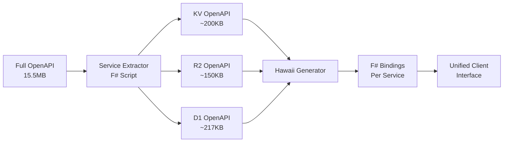

# OpenAPI Generation Strategy for Fidelity.CloudEdge Management APIs

## Executive Summary

This document outlines the strategy for generating F# Management API bindings from Cloudflare's OpenAPI specifications using Hawaii. The Cloudflare OpenAPI spec (15.5MB) presents unique challenges that require a service-specific extraction and generation approach to create maintainable, performant F# client libraries.

## The Challenge: OpenAPI Specification Size

The Cloudflare OpenAPI specification presents significant scale challenges:
- **15.5MB** file size with **300,000+ lines** of JSON/YAML
- **1,000+ endpoints** across 50+ services
- **500+ schema definitions** with deeply nested references
- Single monolithic specification for entire API surface

This creates several problems:
1. Hawaii may struggle or fail with the full specification
2. Generated code would be monolithic and difficult to maintain
3. Compilation times would be excessive
4. IntelliSense performance would degrade significantly

## Solution: Service-Specific Extraction and Generation

### Strategy Overview: Extract → Generate → Compose

Instead of processing the entire OpenAPI spec at once, we extract service-specific subsets and generate modular F# clients:



### Key Principles

1. **Never modify source schemas** - Keep pristine copies in separate repos
2. **Extract to temporary directory** - Service-specific specs are transient artifacts
3. **Generate modular packages** - Each service gets its own F# project
4. **Provide unified client** - Single entry point for all management APIs

## OpenAPI Structure Analysis

### Cloudflare API Organization

```
D:/repos/Cloudflare/api-schemas/
├── openapi.json    # JSON format (15.5MB)
├── openapi.yaml    # YAML equivalent
└── common.yaml     # Shared components
```

### Primary API Scopes

| Scope | Pattern | Example | Use Case |
|-------|---------|---------|----------|
| **Account** | `/accounts/{account_id}/...` | `/accounts/{account_id}/r2/buckets` | Resource management |
| **Zone** | `/zones/{zone_id}/...` | `/zones/{zone_id}/dns_records` | Zone operations |
| **User** | `/user/...` | `/user/tokens` | User management |
| **Global** | `/{service}` | `/memberships` | Cross-account ops |

### Service Categories for Fidelity.CloudEdge

#### Storage Services (Core Fidelity.CloudEdge)
- **KV Namespaces**: `/accounts/{account_id}/storage/kv/namespaces`
- **R2 Buckets**: `/accounts/{account_id}/r2/buckets`
- **D1 Databases**: `/accounts/{account_id}/d1/database`

#### Compute Services
- **Workers**: `/accounts/{account_id}/workers/scripts`
- **Durable Objects**: `/accounts/{account_id}/workers/durable_objects`
- **Pages**: `/accounts/{account_id}/pages/projects`

#### Advanced Services
- **Vectorize**: `/accounts/{account_id}/vectorize/v2/indexes`
- **Queues**: `/accounts/{account_id}/queues`
- **Hyperdrive**: `/accounts/{account_id}/hyperdrive/configs`
- **AI**: `/accounts/{account_id}/ai`

## Implementation Pipeline

### Step 1: Service Extraction Script

Create an F# script that extracts service-specific OpenAPI specs:

```fsharp
// generators/hawaii/extract-services.fsx
#r "nuget: Newtonsoft.Json"

open System.IO
open Newtonsoft.Json
open Newtonsoft.Json.Linq

type ServiceDefinition = {
    Name: string
    PathPatterns: string list
    OperationPrefix: string
    Description: string
}

let services = [
    { Name = "D1"
      PathPatterns = [
          "/accounts/{account_id}/d1/database"
          "/accounts/{account_id}/d1/database/{database_id}"
      ]
      OperationPrefix = "d1"
      Description = "D1 Database Management" }

    { Name = "R2"
      PathPatterns = [
          "/accounts/{account_id}/r2/buckets"
          "/accounts/{account_id}/r2/buckets/{bucket_name}"
      ]
      OperationPrefix = "r2"
      Description = "R2 Object Storage" }

    { Name = "KV"
      PathPatterns = [
          "/accounts/{account_id}/storage/kv/namespaces"
          "/accounts/{account_id}/storage/kv/namespaces/{namespace_id}"
      ]
      OperationPrefix = "kv"
      Description = "KV Storage Management" }

    // IMPORTANT: Use V2 for Vectorize (V1 deprecated August 2024)
    { Name = "Vectorize"
      PathPatterns = [
          "/accounts/{account_id}/vectorize/v2/indexes"
          "/accounts/{account_id}/vectorize/v2/indexes/{index_name}"
      ]
      OperationPrefix = "vectorize"
      Description = "Vectorize Vector Database" }
]

let extractService (sourceFile: string) (service: ServiceDefinition) =
    let spec = JObject.Parse(File.ReadAllText(sourceFile))
    let filtered = JObject()

    // Copy metadata
    filtered.["openapi"] <- spec.["openapi"]
    filtered.["info"] <- JObject()
    filtered.["info"].["title"] <- JValue($"Cloudflare {service.Name} API")
    filtered.["info"].["version"] <- spec.["info"].["version"]
    filtered.["servers"] <- spec.["servers"]

    // Extract matching paths
    let paths = JObject()
    let components = JObject()
    components.["schemas"] <- JObject()

    for path in spec.["paths"].Children<JProperty>() do
        if service.PathPatterns |> List.exists (fun pattern ->
            path.Name.Contains(pattern.Replace("{account_id}", "").Replace("{", "").Replace("}", ""))) then
            paths.[path.Name] <- path.Value
            // Also collect referenced schemas (simplified)

    filtered.["paths"] <- paths
    filtered.["components"] <- components

    // Save to temp directory
    let outputDir = "./temp"
    Directory.CreateDirectory(outputDir) |> ignore
    let outputFile = Path.Combine(outputDir, $"{service.Name.ToLower()}-openapi.json")
    File.WriteAllText(outputFile, filtered.ToString(Formatting.Indented))
    printfn $"Extracted {service.Name} API to {outputFile}"

// Run extraction for all services
let sourceFile = @"D:/repos/Cloudflare/api-schemas/openapi.json"
services |> List.iter (extractService sourceFile)
```

### Step 2: Hawaii Configuration

Create Hawaii configuration for each service:

```json
// generators/hawaii/configs/d1-hawaii.json
{
  "namespace": "Fidelity.CloudEdge.Management.D1",
  "synchronous": false,
  "target": "fsharp",
  "generateClient": true,
  "clientName": "D1ManagementClient",
  "overrideOperationIds": {
    "d1-list-databases": "ListDatabases",
    "d1-create-database": "CreateDatabase",
    "d1-delete-database": "DeleteDatabase",
    "d1-get-database": "GetDatabase",
    "d1-query-database": "QueryDatabase"
  }
}
```

### Step 3: Generation Script

```powershell
# generators/hawaii/generate-management.ps1
$services = @("D1", "R2", "KV", "Vectorize", "Queues", "Hyperdrive")

# Step 1: Extract service specs
Write-Host "Extracting service specifications..." -ForegroundColor Cyan
dotnet fsi extract-services.fsx

# Step 2: Generate F# bindings
foreach ($service in $services) {
    Write-Host "Generating $service Management API..." -ForegroundColor Green

    $input = "./temp/$($service.ToLower())-openapi.json"
    $config = "./configs/$($service.ToLower())-hawaii.json"
    $output = "../../src/Management/Fidelity.CloudEdge.Management.$service/Generated.fs"

    hawaii --input $input --config $config --output $output

    if ($LASTEXITCODE -eq 0) {
        Write-Host "✓ Generated $service successfully" -ForegroundColor Green
    } else {
        Write-Warning "Failed to generate $service"
    }
}

# Step 3: Clean up temp files
Remove-Item "./temp" -Recurse -Force
```

### Step 4: Post-Processing Pipeline

Fidelity.CloudEdge implements an automated post-processing pipeline to handle Hawaii's current limitations and ensure production-ready bindings.

#### Why Post-Processing?

Hawaii is excellent at generating F# clients from OpenAPI specs, but some patterns require additional transformation:
1. **Discriminated Unions**: OpenAPI discriminator schemas aren't natively supported
2. **System.Text.Json**: Migration from Newtonsoft.Json for Fable compatibility
3. **Namespace Standardization**: Ensuring consistent `Fidelity.CloudEdge.Management.*` naming

#### Post-Processing Scripts

Located in `generators/hawaii/`, these F# scripts run after Hawaii generation:

**1. post-process-discriminators.fsx**

Automatically generates F# discriminated unions from OpenAPI discriminator patterns.

```fsharp
// Before: Hawaii generates individual binding types
type workersbindingkindr2bucket = { ... }
type workersbindingkindd1 = { ... }
type workersbindingkindkv = { ... }
// ... 29 total binding types

type workersbindings = list<workersbindingitem>  // ❌ Type 'workersbindingitem' not defined

// After: Post-processor creates discriminated union
type workersbindingitem =
    | R2bucket of workersbindingkindr2bucket
    | D1 of workersbindingkindd1
    | Kv of workersbindingkindkv
    // ... 26 more cases

type workersbindings = list<workersbindingitem>  // ✅ Fully typed!
```

**Usage**:
```bash
dotnet fsi post-process-discriminators.fsx ../../src/Management/Fidelity.CloudEdge.Management.Workers/Types.fs
# Output: ✓ Successfully added discriminated union for workersbindingitem
#         Cases: 29
```

**How it works**:
1. Scans for type patterns matching `workersbindingkind*`
2. Identifies the DU type name from list declarations
3. Generates case constructors with proper F# naming
4. Inserts before the list type declaration

**2. System.Text.Json Migration**

All Hawaii-generated `.fsproj` files now use `FSharp.SystemTextJson` instead of `Newtonsoft.Json`:

```xml
<!-- Old (Newtonsoft.Json) -->
<PackageReference Include="Newtonsoft.Json" Version="13.0.1" />
<PackageReference Include="Fable.Remoting.Json" Version="2.18.0" />

<!-- New (System.Text.Json) -->
<PackageReference Include="FSharp.SystemTextJson" Version="1.3.13" />
```

This ensures Fable compatibility and aligns with modern F# serialization practices.

#### Automated Generation Workflow

For services requiring post-processing (currently Workers):

```powershell
# generators/hawaii/generate-workers.ps1

# 1. Extract service spec
dotnet fsi extract-services.fsx

# 2. Generate with Hawaii
hawaii --config workers-hawaii.json

# 3. Apply post-processing
dotnet fsi post-process-discriminators.fsx ../../src/Management/Fidelity.CloudEdge.Management.Workers/Types.fs

# 4. Copy to source (with correct .fsproj)
cp Generated-Workers/*.fs ../../src/Management/Fidelity.CloudEdge.Management.Workers/
cp Generated-Workers/*.fsproj ../../src/Management/Fidelity.CloudEdge.Management.Workers/

# 5. Verify compilation
cd ../../src/Management/Fidelity.CloudEdge.Management.Workers && dotnet build
```

#### Post-Processing Success Stories

**Workers Management API**:
- ✅ 29 binding types successfully consolidated into discriminated union
- ✅ Full type safety for all Worker binding configurations
- ✅ Clean F# idioms without manual intervention
- ✅ Zero compilation errors after post-processing

**All Management APIs**:
- ✅ System.Text.Json migration complete across 8 services
- ✅ Consistent namespacing (`Fidelity.CloudEdge.Management.*`)
- ✅ Fable-compatible serialization

#### Future Enhancements

These post-processing patterns are candidates for upstreaming to Hawaii:
1. **Native discriminator support**: Hawaii could detect discriminator schemas and generate DUs directly
2. **Attribute-based mapping**: Use `[<JsonPropertyName>]` for reserved keywords instead of backticks
3. **Configurable serialization**: Select System.Text.Json vs Newtonsoft.Json via Hawaii config

## Lessons Learned

### Critical: API Version Deprecation

**Case Study: Vectorize API Migration (September 2025)**

**Problem**: Generated Vectorize client was empty despite successful Hawaii execution

**Root Cause**:
- Cloudflare deprecated Vectorize V1 API in August 2024
- OpenAPI spec only contained deprecated V1 endpoints (`/vectorize/indexes`)
- Hawaii correctly skips deprecated operations by default

**Solution**:
1. Updated extraction patterns to use V2 endpoints (`/vectorize/v2/indexes`)
2. Re-extracted and regenerated successfully
3. Generated client now has all 14 expected methods

**Key Takeaways**:
- Always verify API version status before generation
- Empty generated clients indicate possible deprecated endpoints
- Keep extraction scripts synchronized with current API versions
- Hawaii's behavior of skipping deprecated operations is correct and desirable

### Pattern Matching with Special Characters

**Current Issue**: Hawaii generates discriminated union cases with special characters (`@`, `-`, `.`) that require backtick escaping

```fsharp
// Current generated code requires manual fix:
| ``@cfBaaiBgeSmallEnV1Numeric_5`` -> "@cf/baai/bge-small-en-v1.5"
```

**Recommended Hawaii Enhancement**: Generate semantic names with `CompiledName` attributes
```fsharp
// Desired output:
type VectorizePreset =
    | [<CompiledName "@cf/baai/bge-small-en-v1.5">] CfBaaiBgeSmallEnV15

// Enables clean pattern matching:
match preset with
| CfBaaiBgeSmallEnV15 -> "@cf/baai/bge-small-en-v1.5"
```

**Why This Matters**: This produces idiomatic F# code while preserving correct JSON serialization. See `09_tool_improvement_analysis.md` for comprehensive tool improvement strategies.

## Unified Client Interface

Create a single entry point for all management APIs:

```fsharp
// src/Management/CloudFlare.Management/Client.fs
namespace Fidelity.CloudEdge.Management

open System
open System.Net.Http
open Fidelity.CloudEdge.Management.D1
open Fidelity.CloudEdge.Management.R2
open Fidelity.CloudEdge.Management.KV

type CloudflareManagementClient(apiToken: string, ?httpClient: HttpClient) =
    let httpClient = defaultArg httpClient (new HttpClient())

    do
        httpClient.DefaultRequestHeaders.Add("Authorization", $"Bearer {apiToken}")
        httpClient.BaseAddress <- Uri("https://api.cloudflare.com/client/v4/")

    member _.D1 = D1ManagementClient(httpClient)
    member _.R2 = R2ManagementClient(httpClient)
    member _.KV = KVManagementClient(httpClient)
    member _.Vectorize = VectorizeManagementClient(httpClient)
    member _.Queues = QueuesManagementClient(httpClient)

    interface IDisposable with
        member _.Dispose() = httpClient.Dispose()
```

## Benefits of This Approach

1. **Manageable Scope**: Each service ~45-250KB instead of 15.5MB
2. **Independent Versioning**: Services can be updated independently
3. **Better Performance**: Faster compilation and IntelliSense
4. **Maintainability**: Clear separation of concerns per service
5. **Flexibility**: Different Hawaii settings per service possible
6. **Version Awareness**: Can target specific API versions per service

## Implementation Status

### Completed ✅
- Workers Management API (with post-processing pipeline)
- D1 Management API
- R2 Management API
- Analytics Management API
- Queues Management API
- Vectorize Management API (V2)
- Hyperdrive Management API
- Durable Objects Management API

### In Progress 🔄
- KV Management API (Hawaii complex schema issues)
- Logs Management API (extraction patterns pending)

### Planned 📝
- DNS Management API
- Access/Zero Trust API
- Unified client interface
- F# idiomatic wrappers

## Validation Checklist

### Pre-Generation
- [ ] Verify API endpoints are not deprecated
- [ ] Check extraction patterns match current API versions
- [ ] Validate Hawaii configuration syntax
- [ ] Ensure output directories exist

### Post-Generation
- [ ] Generated files compile without errors
- [ ] All expected methods are present (not empty)
- [ ] Pattern matching issues resolved (backtick escaping)
- [ ] Async return types are consistent
- [ ] Basic CRUD operations testable

## Success Criteria

1. **Compilation**: Each service module compiles independently
2. **Size**: Generated files < 10K lines per service
3. **Performance**: IntelliSense responds in < 1 second
4. **Coverage**: All CRUD operations for each service
5. **Usability**: Idiomatic F# with async workflows
6. **API Version Handling**: Proper support for version transitions
7. **Deprecated Operation Handling**: Clear detection and handling

## Conclusion

By extracting service-specific OpenAPI specifications and generating focused F# bindings, Fidelity.CloudEdge leverages Hawaii effectively despite the massive size of Cloudflare's API surface. This modular approach ensures maintainability, performance, and provides a complete type-safe F# SDK for Cloudflare's management plane that complements our runtime bindings. The strategy handles API version changes gracefully and produces idiomatic F# code suitable for cross-platform compilation via Fable, Fidelity, or standard .NET.